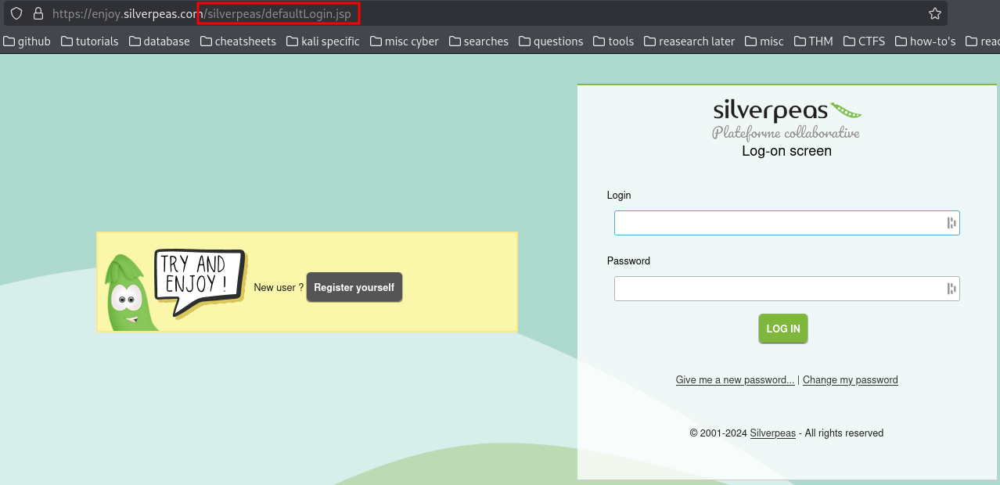

**Silver Platter** is a cool room for exploring web app pentesting using techniques like custom wordlist using cewl to gain access to **Silverpeas**. By then exploiting a vulnerability that allows an authenticated user to read others messages we end up finding **SSH** credentials in one of them.

[{: width="300" height="300" .shadow}](https://tryhackme.com/r/room/silverplatter)
{: .center }

## Enumeration:

### Nmap/Rust Scan

We start with a `rustscan` / `nmap` scan.

```bash
PORT     STATE SERVICE    REASON         VERSION
22/tcp   open  ssh        syn-ack ttl 61 OpenSSH 8.9p1 Ubuntu 3ubuntu0.4 (Ubuntu Linux; protocol 2.0)
| ssh-hostkey: 
|   256 1b:1c:87:8a:fe:34:16:c9:f7:82:37:2b:10:8f:8b:f1 (ECDSA)
| ecdsa-sha2-nistp256 AAAAE2VjZHNhLXNoYTItbmlzdHAyNTYAAAAIbmlzdHAyNTYAAABBBJ0ia1tcuNvK0lfuy3Ep2dsElFfxouO3VghX5Rltu77M33pFvTeCn9t5A8NReq3felAqPi+p+/0eRRfYuaeHRT4=
|   256 26:6d:17:ed:83:9e:4f:2d:f6:cd:53:17:c8:80:3d:09 (ED25519)
|_ssh-ed25519 AAAAC3NzaC1lZDI1NTE5AAAAIKecigNtiy6tW5ojXM3xQkbtTOwK+vqvMoJZnIxVowju

80/tcp   open  http       syn-ack ttl 61 nginx 1.18.0 (Ubuntu)
|_http-title: Hack Smarter Security
|_http-server-header: nginx/1.18.0 (Ubuntu)
| http-methods: 
|_  Supported Methods: GET HEAD

8080/tcp open  http-proxy syn-ack ttl 60
| fingerprint-strings: 
|   FourOhFourRequest: 
|     HTTP/1.1 404 Not Found
|     Connection: close
|     Content-Length: 74
|     Content-Type: text/html
|     Date: Thu, 16 Jan 2025 00:23:34 GMT
|     <html><head><title>Error</title></head><body>404 - Not Found</body></html>
|   GenericLines, Help, Kerberos, LDAPSearchReq, LPDString, RTSPRequest, SMBProgNeg, SSLSessionReq, Socks5, TLSSessionReq, TerminalServerCookie: 
|     HTTP/1.1 400 Bad Request
|     Content-Length: 0
|     Connection: close
|   GetRequest, HTTPOptions: 
|     HTTP/1.1 404 Not Found
|     Connection: close
|     Content-Length: 74
|     Content-Type: text/html
|     Date: Thu, 16 Jan 2025 00:23:33 GMT
|_    <html><head><title>Error</title></head><body>404 - Not Found</body></html>
```

There are three open ports:

- **22** (`SSH`)
- **80** (`HTTP`)
- **8080** (`HTTP`)

### SSH 22

I first check to see if password authentication is even enabled

```bash
┌──(kali㉿kali)-[~/THM/ctfs/SilverPlatter]
└─$ ssh root@silver.local 
root@silver.local's password:
```

Great!, I put that to the side and continue on. . .

### Web 80

Checking `http://10.10.199.249/`, we find a static site.

{: width="1200" height="600"}

I interact with the entire page and I find something interesting. . 

{: width="1200" height="600"}

Looks like we found some information disclosure, something called `Silverpeas` and a username `scr1ptkiddy`
Let's find out what `Silverpeas` is by using the almighty google search!

To-Do:

- Enumerate Silverpeas
- Username Enumeration: `scr1ptkiddy`

Upon finding their web page it looks like it's a web app. Now the question is. . . 
How do we access this application? 

### Web 8080

From our rustscan we found it has an open port on `8080` but if we go to `http://10.10.199.249:8080` we see there is nothing there.  
Hmmm. . . There must be a way to access the web app through a path but if you do a dirsearch you'll find nothing again. .

Let's look around `https://www.silverpeas.org/` to see if we can find a way in.

{: width="1200" height="600"}

I notice right away a button that says **"Find out how to install and configure Silverpeas in Production"**  
Let's follow that!

Looking through the page, I noticed a link to a demonstration page which immediately caught my attention.

{: width="1200" height="600"}

**Aha!** The demo took us to their login page and it reveals the path needed to access the application!

{: width="1200" height="600"}

> `http://10.10.199.249:8080/silverpeas/defaultLogin.jsp`

{: width="1200" height="600"}

## Brute Force:

Now at this point I will say that I was scratching my head, brute forcing with any password file will be futile.
It was stated at the beginning that their password policy requires passwords that have **NOT** been breached.

After some time I thought to myself, maybe there's another hint somewhere in the description. Especially since he took the time to write something we could have found out for ourselves. And after reading it a couple times I noticed the word `cool` was quoted for some reason.  

{: width="1200" height="600"}

Kali comes with a built in tool called cewl which stands for custom word list generator. Here is the description taken from kali's website

{: .note}
> CeWL (Custom Word List generator) is a ruby app which spiders a given URL, up to a specified depth, and returns a list of words which can then be used for password crackers such as John the Ripper. Optionally, CeWL can follow external links.

Now that's cool! (no pun intended lol)
Let's output the contents to a `.txt` file and try brute forcing with it!

```bash
┌──(kali㉿kali)-[~]
└─$ cewl 10.10.199.249 > silverpass.txt
```

A lot of you are familiar with burp suite, but 99% of you (like me) do not have the pro version, so we are limited in speed. If you have not checked out [Caido](https://caido.io/) I highly recommend it. It's slick and best of all it won't limit you!  
And did I mention **free**?

Let's intercept some traffic and try brute forcing with our new list!
Go ahead and turn it on and type in a random password with the username we found.

{: width="1200" height="600"}

Then send the intercepted traffic to `Automate`

{: width="1200" height="600"}

Mark the password field.  
Here is where the payload will be used.

{: width="1200" height="600"}

And. . . **SUCCESS** we have authentication! 

{: width="1200" height="600"}

## Silverpeas:

Let's go ahead and login. .

{: width="1200" height="600"}

If you look around the dashboard, one thing that stood out to me was an unread notification on the top left. 
When you click it, a new window pops up. At first you find there's no information disclosure of any sort and it seems irrelevant. 
That is of course until you look at the URL. .

What stands out? `ID=5` 

{: width="1200" height="600"}

This is a case of ***Insecure direct object reference*** or ***IDOR***  
If you try changing that number eventually it will lead you to a message from the admin exposing the password needed for ssh login!

{: width="1200" height="600"}

## SSH & Post-Exploitation:

After authenticating through SSH we find our first flag!

{: width="1200" height="600"}

One of the first thing I usually do is to check sudo privileges on the user, let's go ahead and do just that.

```bash
tim@silver-platter:~$ sudo -l
[sudo] password for tim: 
Sorry, user tim may not run sudo on silver-platter.
tim@silver-platter:~$ id
uid=1001(tim) gid=1001(tim) groups=1001(tim),4(adm)
```

It looks like we are not part of the sudo group, but I am curious about this `4(adm)` group.
Let's do a quick google search what this group is all about and what kind of privileges come with it.

{: width="1200" height="600"}

It seems like this group is meant for system monitoring and is allowed to view log files. 
If you head over to `/var/log` you'll notice right away there's a lot of them, and if you are a good hacker, you are somewhat lazy and don't have the time to be checking each file one by one!

This is where tools like grep are a godsend.

```bash
tim@silver-platter:/var/log$ grep -ir "password"
```

The `-i` flag Makes the search case-insensitive, allowing for matches regardless of letter case.  
The `-r` flag recursively searches through directories and all files within them.

This command will search recursively through all the logs and searches for the keyword password. Let's see if we find anything juicy!

**Lo' and behold we caught something!**

{: width="1200" height="600"}

Let's try to change to the user tyler using `sudo su`  
Awesome!, the password worked.  

If we check `id` it seems like this user `tyler` has `sudo` access!.

```bash
tim@silver-platter:/var/log$ su tyler
Password: 
tyler@silver-platter:/var/log$ 
tyler@silver-platter:/var/log$ id
uid=1000(tyler) gid=1000(tyler) groups=1000(tyler),4(adm),24(cdrom),27(sudo),30(dip),46(plugdev),110(lxd)
tyler@silver-platter:/var/log$ sudo su
[sudo] password for tyler:
root@silver-platter:/var/log#
root@silver-platter:~# cd /root/
root@silver-platter:~# ls
root.txt  snap  start_docker_containers.sh
```

And there you have it.  
Seems like we have **outsmarted** the Hack Smarter Security Team hehe. . 

